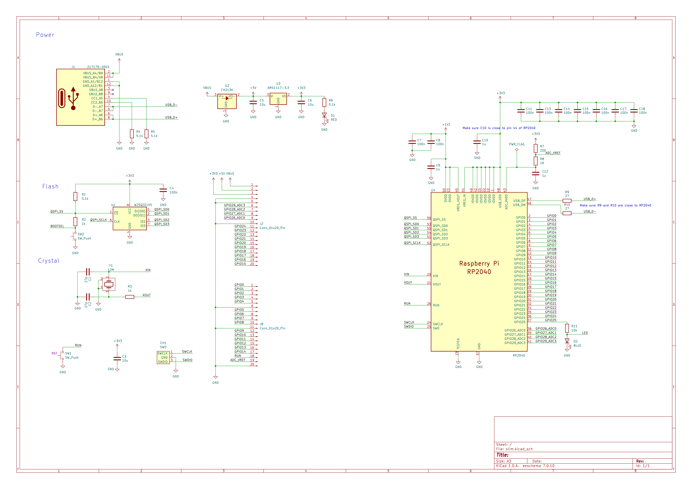
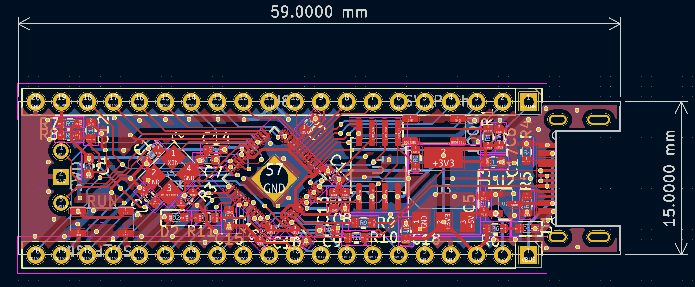

## 回路図

## PCB

## 部品一覧

部品 | 値        | 部品  | 値
-----|-----------|-------|------------
C1	 | 	27 pF	 | 	R1	 | 	5.1 kΩ
C2	 | 	27 pF	 | 	R2	 | 	1 kΩ
C3	 | 	10 uF	 | 	R3	 | 	1 kΩ
C4	 | 	100 nF	 | 	R4	 | 	5.1 kΩ
C5	 | 	10 uF	 | 	R5	 | 	5.1 kΩ
C6	 | 	10 uF	 | 	R6	 | 	5.1 kΩ
C7	 | 	100 nF	 | 	R7	 | 	200 Ω
C8	 | 	100 nF	 | 	R8	 | 	1 Ω
C9	 | 	1 uF	 | 	R9	 | 	27 Ω
C10	 | 	1 uF	 | 	R10	 | 	27 Ω
C11	 | 	100 nF	 | 		 | 	
C12	 | 	1 uF	 | 	U1	 | 	W25Q32JVS   
C13	 | 	100 nF	 | 	U2	 | 	CH213K      
C14	 | 	100 nF	 | 	U3	 | 	AMS1117-3.3 
C15	 | 	100 nF	 | 	U4	 | 	RP2040      
C16	 | 	100 nF	 | 		 | 	
C17	 | 	100 nF	 | 	Y1	 | 	Crystal 12MHz
C18	 | 	100 nF	 | 	J1	 | 	USB-C Connector

