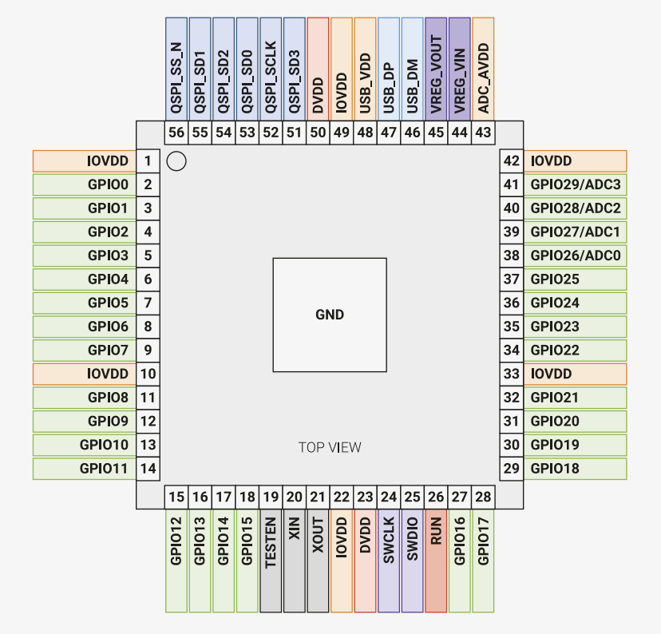

# RP2040を直接実装した自作キーボードを作成する

いきなりは難しいので最初にRaspberry Pi Pico相当のものを作成して、動作確認し、  
そのうえで作成する。  
完成は春節前を目標とする。  

## 調査1 資料

公式ドキュメント  
https://datasheets.raspberrypi.com/rp2040/hardware-design-with-rp2040-JP.pdf  
日本語助かる。  

Ki-CADのファイル  
https://datasheets.raspberrypi.com/rp2040/Minimal-KiCAD.zip  
至れり尽くせり助かる。

## 調査2 読解

とりあえず読む。
わからない単語を調べたらメモる。

### 1章

#### P4-5

> 
> 
> 専用の SPI、DSPI、QSPI インターフェイスを使用して、外部メモリーからコードを直接実行することができます。  
> サイズの小さなキャッシュにより、標準的なアプリケーションのパフォーマンスが向上します。  
> SWD インターフェイスを使用してデバッグを行うことができます。  
> 内蔵 SRAM は、コードやデータを格納するバンク内に配置されます。  
> 専用の AHB バスファブリック接続経由で内蔵 SRAM にアクセスされるため、  
> バスマスターはブロックされることなく個別のバススレーブにアクセスすることができます。  
> DMA バスマスターにより、反復的なデータ転送タスクをプロセッサーからオフロードすることができます。  
> GPIO ピンは、直接起動することも、各種の専用ロジック関数から起動することもできます。  
> 周辺機器専用 IP により、SPI、I2C、UART などの固定機能が提供されます。  
> 柔軟な構成が可能な PIO コントローラーを使用して、さまざまな IO 機能を実行することができます。  
> PHY が内蔵されたシンプルな USB コントローラーにより、ソフトウェアの制御下で FS/LS ホストまたは FS/LS デバイスに接続することができます。  
> 4 つの GPIO で、ADC 入力付きのパッケージピンが共有されます。  
> 2 つの PLL により、USB または ADC の 48MHz 固定クロックと、最大 133MHz の柔軟なシステムクロックが稼働します。  
> 内蔵の電圧レギュレーターによってコア電圧が供給されるため、完成品で供給する必要があるのは IO 電圧だけになります。  

chatgptによる用語の説明。

| 用語 | 説明 |
|------|------|
| SPI (Serial Peripheral Interface) | シリアル通信プロトコルで、マスターとスレーブ間でデータ交換を可能にします。RP2040では、外部デバイスとの高速通信に用いられます。 |
| DSPI (Dual SPI) | SPIの変種で、2つのデータラインを使用して同時にデータを送受信することができ、転送速度が向上します。 |
| QSPI (Quad SPI) | SPIの拡張版で、4つのデータラインを使ってデータ転送を行います。これにより、さらに高速なデータ転送が可能になります。 |
| SWD (Serial Wire Debug) インターフェイス | JTAGの代替として設計されたデバッグインターフェイスで、少ないピン数でフル機能のデバッグが可能です。RP2040では、プログラムのデバッグに使用されます。 |
| 内蔵 SRAM (Static Random Access Memory) | 高速アクセス可能なメモリで、RP2040ではコードやデータの格納に使用されます。低遅延であり、プロセッサの性能向上に貢献します。 |
| AHB (Advanced High-performance Bus) バスファブリック接続 | 高性能なシステムバスの一種で、RP2040では内蔵SRAMへの効率的なアクセスを提供します。バスマスターが個別のバススレーブにアクセスする際にブロックされることがありません。 |
| DMA (Direct Memory Access) バスマスター | CPUの代わりにデータ転送を行うハードウェア。RP2040では、反復的なデータ転送をプロセッサーからオフロードし、効率を高めます。 |
| オフロードする | あるタスクや処理を、主処理装置（例えばCPU）から別の装置（例えばDMA）に移行させること。これにより、主処理装置の負荷を軽減し、全体の効率を向上させます。 |
| 周辺機器専用 IP (Intellectual Property) | 専用のハードウェアモジュールやデザイン。RP2040では、SPI、I2C、UARTなどの固定機能を提供するために用いられます。 |
| PIO (Programmable I/O) コントローラー | ユーザーがプログラム可能なI/Oコントローラー。RP2040では、さまざまなI/O機能をカスタマイズして実行するために使用されます。 |
| PHY (Physical Layer) | 通信ネットワークの物理層を担う部分。RP2040では、USB通信の物理層を内蔵しており、FS/LSホストやデバイスとして機能します。 |
| FS/LS ホスト (Full-Speed/Low-Speed Host) | USBの通信速度規格の一つ。RP2040はFS（フルスピード）とLS（ロースピード）のホストとして機能できます。 |
| FS/LS デバイス (Full-Speed/Low-Speed Device) | USBデバイスとしての動作モード。RP2040では、USBやADC用の固定クロックおよび柔軟なシステムクロックを生成するために使用されます。|

理解した内容。(ざる)  
* SPI/DSPI/QSPI経由で外部のメモリから直接コードを実行できる。
* SWD(Serial Wire Debug)経由で少ないピン数でデバッグできる。

## 第2章 最小設計例
### P6

理解した内容。  
* PCBの厚さは1mm。1.6mmだとUSBの特性インピーダンスに関する問題が発生する可能性がある。(後述)

### P7-8

理解した内容。  
最小設計は4つの要素からなる。
* 電源
* フラッシュストレージ
* 水晶発振器
* IO

### 電源
* 1.1V(コア用) 
	* RP2040の内臓レギュレータによって3.3Vから変換されるので無視してよい。
* 3.3V(IO用)
	* 外部から与える必要がある。通常USB(5V)から得る。  
	
	
	* USB_B_Micro
		* VBUSにPCからの5Vが来ている。
		* IDはUSB On the Goのための信号線。GNDに落とすとホスト扱いになる。繋がないとデバイス扱いされる。
		* この回路ではデバイス扱いされるはず。
	* NCP1117-3.3_SOT223
		* 3端子レギュレータ。PCから供給された5VのVBUSから、RP2040のIO用電圧3.3Vを生成する。1Aまで供給できるらしい。
		* NCP1117のデータシートに入力側、出力側の両方に10uFのコンデンサが必要らしい。
	* C1,C4
		* データシート日本語助かる。
		* NCP1117のデータシート https://www.onsemi.jp/download/data-sheet/pdf/ncp1117-d.pdf
		> 外付けけコンデンサ  
		> デバイスが電源から数インチいじょうはなれたば所に設置された場合、  
		> レギュレータを安定させるために入力バイパスコンデンサC_inが必要になる可能性があります。  
		> このコンデンサは、複雑な入力インピーダンスを通じて電力が供給される場合に回路が過敏に反応するのを抑制し、出力過渡応答を大幅に改善させます。  
		> 入力バイパスコンデンサはできるだけハイ船長が短くなるように、レギュレータの入力端子とグランド端子の間に直接取り付ける必要があります。  
		> 10uFのセラミックコンデンサまたはタンタルコンデンサであればほとんどのアプリケーションに対して十分な効果があります。  
		> コンデンサC_outによってレギュレータの周波数保証が行われるため、出力を安定させるにはこのコンデンサの使用は必須です。  
		> 33mΩ ~ 2.2mΩ という制限内の等価直列抵抗(ESR)を持つ、4.7uFの最小容量値が必要です。。
		> 
	* バイパスコンデンサ
		
		* 100nFのコンデンサ。
			* ピン付近に配置する必要がある。
			* 右側の3.3Vについているコンデンサ(C10)は高周波ノイズをGNDに落とす目的だと思われる。
			* 左側の1.1Vについているコンデンサ(C8)はコアの電圧平滑目的だと思われる。
			* 回路図だと同じ扱いのコンデンサでも、PCB上だと明らかに違う役割のものがある。PCB見る必要がある。
			* その他はよくわからない。こんなにたくさんつけるのか...
			> 最初に、すべてのチップピンをデバイスから話して配線するための十分なスペースを確保するため、
			> 使用するバイパスコンデンサの数を絞り込む必要があります。この設計では、デバイス上のスペースにあまり余裕がないため、
			> RP2040のピン48と49で同じコンデンサを共有しています。(省略)
			> この設計では、使用するバイパスコンデンサの数を減らし、最適な距離よりも少しだけピンから離れた位置にコンデンサを配置することにより、複雑さとコストを低減しています。
			> 過剰な電圧ノイズによって最小電圧を下回る可能性がありますが、この設計には、最大動作速度を制限する効果があります。殆どの場合、この電圧と動作速度のトレードオフが問題になることはありません。

	* 内臓電圧レギュレータ (9ページ)
		* 

### フラッシュストレージ
### 水晶発振器
### IO

## 設計

### 仕様

* 細長いraspberry pi pico
	* 厚さ
		* 部品は片面実装
		* できるだけ薄く。
	* 幅 USB-Cソケット+Δ
		* ~15mmくらい
	* 長さ
		* 長くてよい。
		* 圧し折ってIOピンの数を減らせるようにする。

### メモ

* ADC_AVDD
	* 
> When using an ADC input shared with a GPIO pin, the pin’s digital functions must be disabled by setting IE low and OD high in the pin’s pad control register. See Section 2.19.6.3, “Pad Control - User Bank” for details. The maximum ADC input voltage is determined by the digital IO supply voltage (IOVDD), not the ADC supply voltage (ADC_AVDD). For example, if IOVDD is powered at 1.8V, the voltage on the ADC inputs should not exceed 1.8V even if ADC_AVDD is powered at 3.3V. Voltages greater than IOVDD will result in leakage currents through the ESD protection diodes. See Section 5.5.3, “Pin Specifications” for details.
> GPIO ピンと共有される ADC 入力を使用する場合、ピンのパッド制御レジスタで IE を Low に、OD を High に設定して、ピンのデジタル機能を無効にする必要があります。 詳細については、セクション2.19.6.3「パッドコントロール - ユーザーバンク」を参照してください。 最大 ADC 入力電圧は、ADC 電源電圧 (ADC_AVDD) ではなく、デジタル IO 電源電圧 (IOVDD) によって決まります。 たとえば、IOVDD が 1.8V で電源供給されている場合、ADC_AVDD が 3.3V で電源供給されていても、ADC 入力の電圧は 1.8V を超えてはなりません。 電圧が IOVDD を超えると、ESD 保護ダイオードを介して漏れ電流が発生します。 詳細については、「5.5.3 ピンの仕様」を参照してください。

* pin

* GPIOx
	* General-purpose digital input and output. RP2040 can connect one of a number of internal peripherals to each GPIO, or control GPIOs directly from software.
	* 汎用デジタル入出力。RP2040は、内部の様々なペリフェラルを各GPIOに接続することができるほか、ソフトウェアから直接GPIOを制御することもできます。
* GPIOx/ADCy
	* General-purpose digital input and output, with analogue-to-digital converter function. The RP2040 ADC has an analogue multiplexer which can select any one of these pins, and sample the voltage.
	* アナログ-デジタル変換機能を持つ汎用デジタル入出力。RP2040のADCにはアナログマルチプレクサがあり、これらのピンのいずれかを選択し、電圧をサンプリングすることができます。
* QSPIx
	* Interface to a SPI, Dual-SPI or Quad-SPI flash device, with execute-in-place support. These pins can also be used as software-controlled GPIOs, if they are not required for flash access.
	* SPI、デュアルSPI、クアッドSPIフラッシュデバイスへのインターフェースで、実行中の場所のサポートがあります。これらのピンは、フラッシュアクセスに必要でない場合、ソフトウェア制御のGPIOとしても使用できます。
* USB_DM and USB_DP
	* USB controller, supporting Full Speed device and Full/Low Speed host. A 27Ω series termination resistor is required on each pin, but bus pullups and pulldowns are provided internally.
	* USBコントローラーで、フルスピードデバイスおよびフル/ロースピードホストをサポートします。各ピンには27Ωの直列終端抵抗が必要ですが、バスのプルアップとプルダウンは内部で提供されます。
* XIN and XOUT
	* Connect a crystal to RP2040’s crystal oscillator. XIN can also be used as a single-ended CMOS clock input, with XOUT disconnected. The USB bootloader requires a 12MHz crystal or 12MHz clock input.
	* RP2040のクリスタルオシレータにクリスタルを接続します。XINは、XOUTが切断された状態で、単端CMOSクロック入力としても使用できます。USBブートローダーには12MHzのクリスタルまたは12MHzのクロック入力が必要です。
* RUN
	* Global asynchronous reset pin. Reset when driven low, run when driven high. If no external reset is required, this pin can be tied directly to IOVDD.
	* グローバル非同期リセットピン。低い状態でリセット、高い状態で動作します。外部リセットが不要な場合、このピンはIOVDDに直接接続されます。
* SWCLK and SWDIO
	* Access to the internal Serial Wire Debug multi-drop bus. Provides debug access to both processors, and can be used to download code.
	* 内部シリアルワイヤデバッグマルチドロップバスへのアクセス。両方のプロセッサへのデバッグアクセスを提供し、コードのダウンロードにも使用できます。
* TESTEN
	* Factory test mode pin. Tie to GND.
	* 工場テストモードピン。GNDに接続します。
* GND
	* Single external ground connection, bonded to a number of internal ground pads on the RP2040 die.
	* 単一の外部グラウンド接続で、RP2040ダイ上の複数の内部グラウンドパッドに接続されています。
* IOVDD
	* Power supply for digital GPIOs, nominal voltage 1.8V to 3.3V
	* デジタルGPIOの電源供給で、公称電圧は1.8Vから3.3Vです。
* USB_VDD
	* Power supply for internal USB Full Speed PHY, nominal voltage 3.3V
	* 内部USBフルスピードPHYの電源供給で、公称電圧は3.3Vです。
* ADC_AVDD
	* Power supply for analogue-to-digital converter, nominal voltage 3.3V
	* アナログ-デジタル変換器の電源供給で、公称電圧は3.3Vです。
* VREG_VIN
	* Power input for the internal core voltage regulator, nominal voltage 1.8V to 3.3V
	* 内部コア電圧レギュレータの電源入力で、公称電圧は1.8Vから3.3Vです。
* VREG_VOUT
	* Power output for the internal core voltage regulator, nominal voltage 1.1V, 100mA max current
	* 内部コア電圧レギュレータの電源出力で、公称電圧は1.1V、最大電流は100mAです。
* DVDD
	* Digital core power supply, nominal voltage 1.1V. Can be connected to VREG_VOUT, or to some other board-level power supply.
	* デジタルコアの電源供給で、公称電圧は1.1Vです。VREG_VOUTに接続することも、他のボードレベルの電源供給に接続することもできます。

